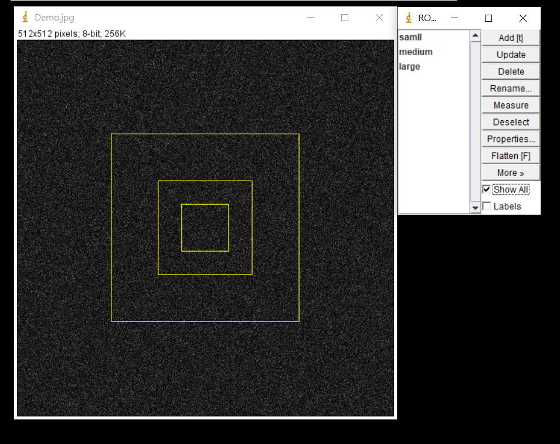

# WriteImageROI

This project aims to create regions of interest (ROIs) compatible with ImageJ.

The program refers to the ImageJ API:
- https://imagej.nih.gov/ij/developer/source/ij/io/RoiDecoder.java.html
- https://imagej.nih.gov/ij/developer/source/ij/io/RoiEncoder.java.html

Currently, the function (FunWriteROI.py) can only create rectangles with integer parameters (left, top , widht, height).

Usage:
1. Include the FunWriteROI.py into the your project folder.
2. Import the function into your program.
3. Collect RectRoi objects and export to the desired path.

Example:

```
  from FunWriteROI import *

  filepath= '.\\'

  roi_1 = RectRoi(223,223,64,64,name='samll')
  roi_2 = RectRoi(191,191,128,128,name='medium')
  roi_3 = RectRoi(127,127,256,256,name='large')
  RoiList = [roi_1,roi_2,roi_3]
  WriteRois(RoiList,filepath,'TestROIs')
```

The example (main.py) export a zip file (TestROIs.zip) containing 3 different size rectangle as in the following picture.
<h1 align="center">

